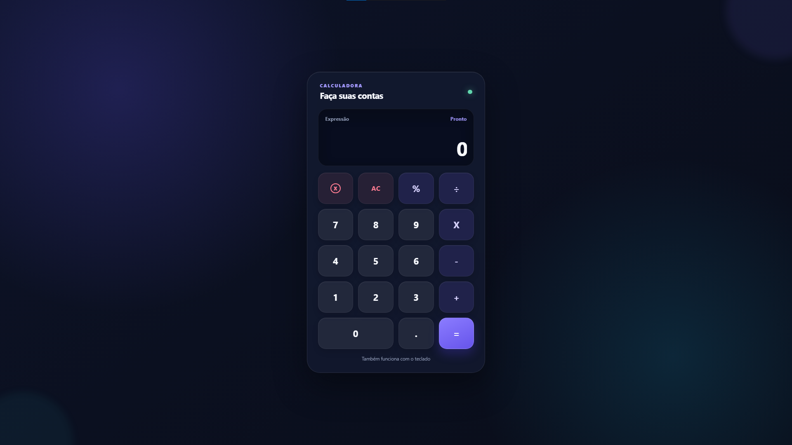

# Responsive Web Calculator

A modern, responsive web calculator built with HTML, CSS and JavaScript.

## About the Project

This project is a modern and responsive web calculator featuring a clean user interface, keyboard support, and essential arithmetic operations.

It was developed to practice front-end development, JavaScript logic, responsive design, and code organization.

## Features

- Addition
- Subtraction
- Multiplication (`X`)
- Division (`/`)
- Percentage (`%`)
- Decimal numbers
- Responsive design
- Keyboard support
- AC button (clear all)
- Delete button (remove the last character)
- Division by zero validation
- Invalid operation handling

## Technologies

- HTML5
- CSS3
- JavaScript

## Keyboard Controls

| Key | Action |
|------|--------|
| `0` – `9` | Numbers |
| `+` | Addition |
| `-` | Subtraction |
| `*` | Multiplication (displayed as **X**) |
| `/` | Division |
| `%` | Percentage |
| `.` | Decimal point |
| `Enter` | Calculate |
| `Backspace` | Delete last character |
| `Escape` | Clear all (AC) |

## Preview

## Author

Developed by **Pedro Trimboli**.
